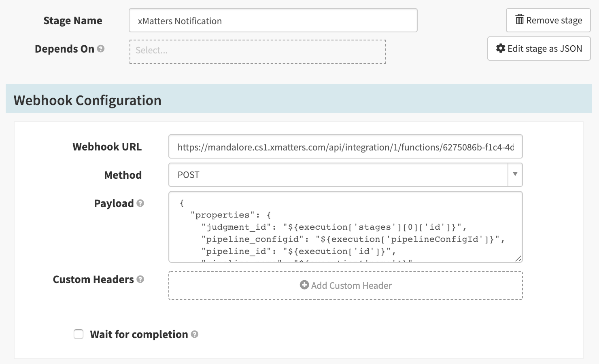
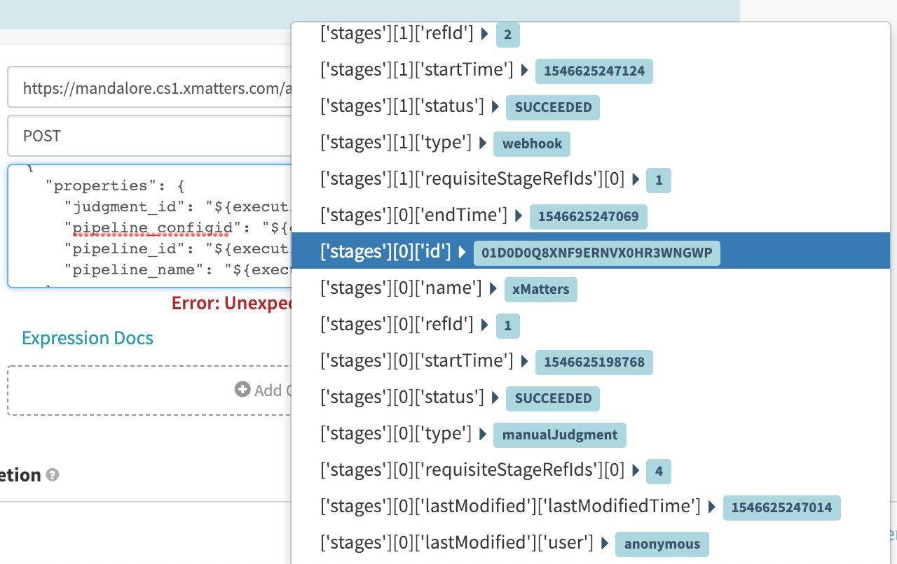
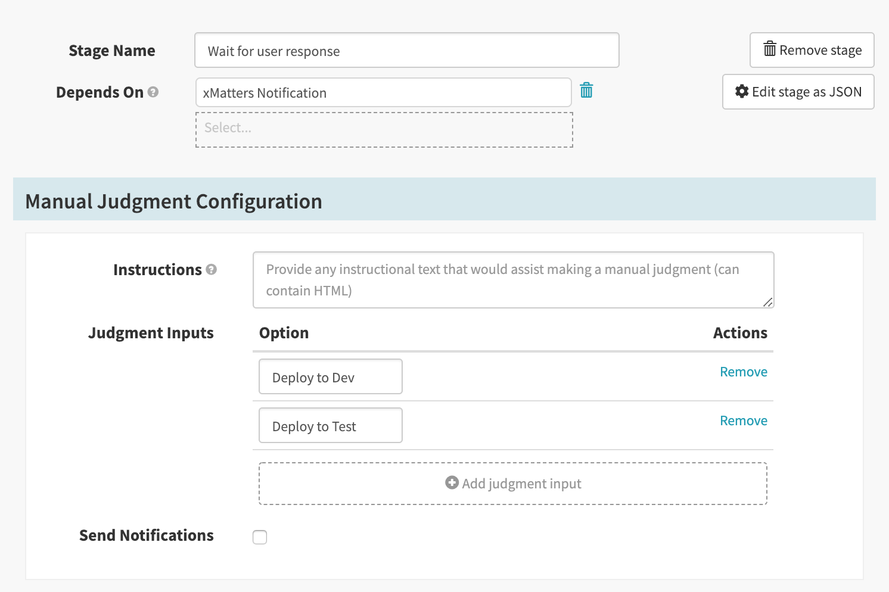
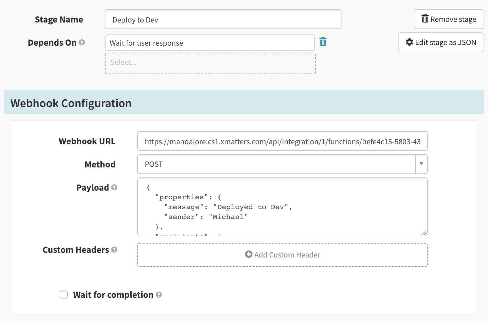
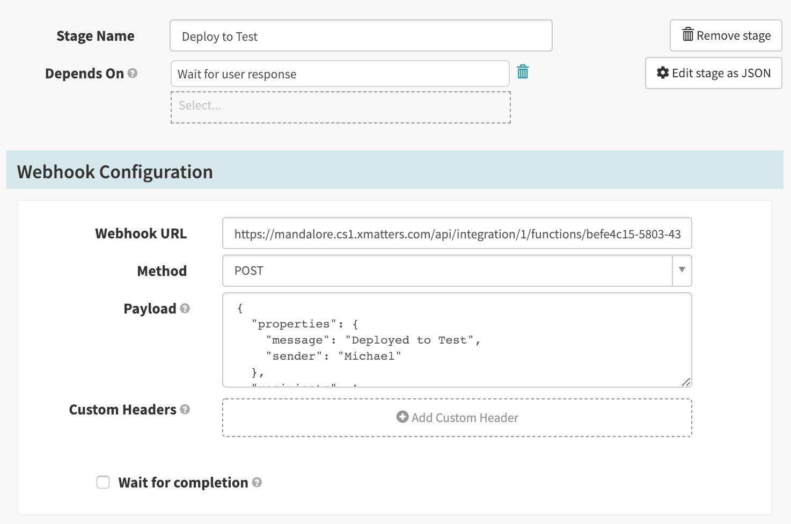
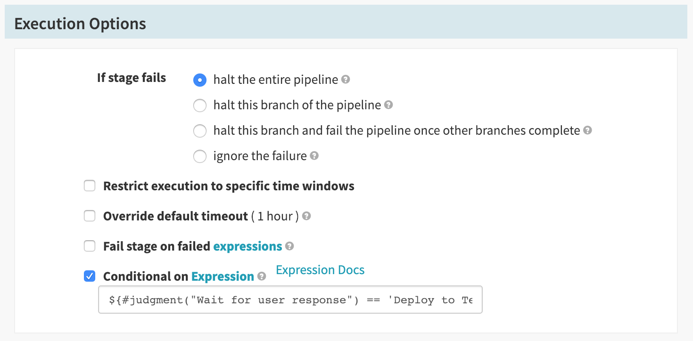

# Spinnaker <--> xMatters integration
This is part of the xMatters Labs awesome listing. For others, see [here](https://github.com/xmatters/xMatters-Labs)
With this Outbound Integration, notification recipients can quickly continue a pipeline that requires a user response to do something via spinnaker

This document details how to install and use this integration. 

---------

<kbd>

</kbd>

---------
# Pre-Requisites
* A spinnaker application with either an exposed gate port using some form of authentication or a local deployment with the xMatters agent installed
* A communication plan - use [this example](./SpinnakerExample.zip) plan to start
* xMatters account - If you don't have one, [get one](https://www.xmatters.com)! 

# Files
* [SpinnakerExample.zip](./SpinnakerExample.zip) - Example Communication Plan, easiest deployment strategy to get a spinnaker integration quickly working
* [InboundScript.js](./InboundScript.js) - This is the inbound resonse script that responds to the Spinnaker webhook when a pipeline starts 
* [OutboundScript.js](./OutboundScript.js) - This is the outbound response script that accepts the response from the notification recipient, inspects the response option selected, then continues (or stops) the spinnaker pipeline using the selected option

# Installation
## Spinnaker setup
1. Navigate to your spinnaker endpoint in the browser. This will either be an external IP or url if you have one set, or localhost:9000 if you are using an ssh tunnel
2. From the homepage, click `Actions` > `Create Application`
3. Fill in the name and email address fields, then click `Create`
4. Click `Pipelines`, then create a new pipeline
5. Configure your pipeline, an example of an integration to xMatters is below, the basic idea is (some prerequisite) -> (webhook to xMatters) -> (manual judgment) -> (different branches based on user response)

- - - -

## xMatters Pipeline:
In a pipeline that integrates spinnaker with xMatters, there will be five main things that need to be configured:
1. A `Webhook` stage in the spinnaker pipeline that fires off a notification to xMatters
2. A `Manual Judgment` stage in spinnaker that pauses the pipeline until a user response is received from xMatters
3. An inbound response script in xMatters that triggers an event and sends a message to certain recipients, requesting a user response
4. An outbound response script in xMatters that takes the user response and triggers spinnaker to continue with (or stop) the pipeline
5. One or more stages in spinnaker that fire depending on the xMatters response

Here is an example of a simple pipeline that sends a notification to xMatters, waits for a user response, then deploys either the dev or test devlopment:


## Webhook Pipeline Stage - Spinnaker to xMatters
Overview:
The webhook stage is the stage that kicks off everything; it sends a notification to xMatters to prompt a human for a response, then depending on the response will kick off either the “Deploy to Dev” or “Deploy to Test” pipeline.

Here is an example webhook stage:


Things that need to be configured are:
- Webhook URL: This is the Url in the xMatters Inbound Integration, we will create the Communication Plan in xMatters later and fill this in (fill it in now if you already have an inbound integration set up)
- Method: cURL method, in this case POST
- Payload: Payload to send in the cURL POST

Here is an example payload to send to xMatters:
```
{
  "properties": {
    "judgment_id": "${execution['stages'][0]['id']}",
    "pipeline_id": "${execution['id']}",
    "pipeline_name": "${execution['name']}"
  },
  "recipients": [
    {
      "id": "msorenson",
      "recipientType": "PERSON"
    }
  ]
}
```
It is very important to include the respective `judgment_id` , `pipeline_id`, and `pipeline_name`, some notes on these values:
- Inside the spinnaker payload, there are many provided variables you can pass to xMatters, some that we must have to communicate with spinnaker:
- `${execution[‘stages’][0][‘id’]}` - the id of the manual judgment stage, in the example we are working with, this is the `Wait for user response` stage. You will have to find the stage yourself by type `${execution[` then scrolling through the autofilled values and selecting the `id` value containing the id that correlates with the manual judgment stage, as shown in the screenshot below — Note how we are selecting the manual judgment stage, **not** the webhook stage.


- `${execution[‘id’]}` - the id of the current execution of the pipeline (not to be confused with `${execution['pipelineConfigId’]}`, which is the id of the pipeline, that stays the same across each execution; this cannot be used to fire curl commands and is not useless for this example)
## Manual Judgment Stage: 
Overview:
The manual judgment stage is normally used in spinnaker to require a user to response inside the spinnaker application in order for the pipeline to continue. Spinnaker does have a email feature, but this only gives you a link to the pipeline, at which point you can choose an option. With xMatters, we can customize response options and have the pipeline be continued all with one click via email response options. For our purposes, the manual judgment stage serves as a "pause" in the pipeline while xMatters waits for the user response

An example of a manual judgment stage


You may either define your own judgment inputs or use leave it blank to use the defaults of  `continue` and `stop`. If you plan to have multiple response options in xMatters with a couple different resulting stages that will fire depending on the response, you should define a judgment input for each of these.

## Inbound Response Script - Receiving in xMatters
Now we will set up the communication plan in xMatters. The simplest option is to import our [example Communication Plan](./SpinnakerExample.zip) and modify it however you like. To do this:
1. Download the [example](./SpinnakerExample.zip) onto your local machine
2. Navigate to the `Developer` Tab in your xMatters instance, then click on `Import Plan`
3. Click on `Choose file`, then locate the example plan you downloaded and click `Open`
4. Find `Spinnaker Example` under your Communication Plans, then click `Edit` > `Integration Builder`
5. Click `Edit Endpoints` and change the the endpoint to your exposed spinnaker address (Note, if you are using a local deployment or an endpoint that isn't exposed publicly you will have to use an agent, see [xMatters Agent](https://help.xmatters.com/ondemand/xmodwelcome/xmattersagent/xmatters-agent-topic.htm) for help setting it up; in this case, you will be running the script on the agent, and the endpoint will be `http://localhost:8084`)
6. Save your endpoint, then click the Outbound integration `Spinnaker Response`, and scroll down and click on `Edit Script`.
## Outbound Response Script - Sending back to Spinnaker
Next we will customize the response options.
1. Navigate to the Forms section of the Communication Plan.
2. For the `Pipeline Started` form, click on `Edit` > `Responses`
3. Change the response options to whatever you would like to use the xMatters - Spinnaker integration for. For example, if you are using it to shutdown a cluster or start up a cluster, you can change the responses to "Shutdown cluster" and "Start up cluster". 
4. Make sure the responses are customized how you would like them, and click `Save Changes` in the top right.
5. Next, go back to the Integration Builder, and open the dropdown menu for Outbound integrations, and click on `Spinnaker Response`
6. Scroll down and click on `Edit Script`. Replace the following if statements to match the responses you filled out in (3). 
```
if (payload.response == 'Deploy to Dev') { //This string should match the response option in xMatters
body.judgmentStatus = 'continue'; //Must be `continue` to continue the pipeline, or `stop` to stop it
body.judgmentInput = 'deploy to dev'; //This string should match (in lower case) the name of a Manual Judgment input in Spinnaker
}
else if (payload.response == 'Deploy to Test') { //This string should match the response option in xMatters
body.judgmentStatus = 'continue'; //Must be `continue` to continue the pipeline, or `stop` to stop it
body.judgmentInput = 'deploy to test'; //This string should match (in lower case) the name of a Manual Judgment input in Spinnaker
}
else if (payload.response == 'Stop') { //This string should match the response option in xMatters; Note - you don't need to have a `Stop` option
body.judgmentStatus = 'stop'; //Must be `continue` to continue the pipeline, or `stop` to stop it
body.judgmentInput = 'stop'; //This doesn't need to be an input in the Manual Judgment to successfully stop the pipeline
}
```
* replace the `Deploy to Dev` and `Deploy to Test` to whatever you named the Responses in the Inbound Integration. Note, you do not need to have a `Stop` option, and you can have as few or as many options as you like, as long as they have a matching `judgmentInput` - the name of one of the inputs you defined in the Spinnaker Manual Judgment stage
7. Click `Save`, then exit the script editor. You're done with the xMatters side!
## Spinnaker continuation - Deploy to Dev/Deploy to Test Stage: 
### Deploy to Dev Stage
For this example we are simply sending a message back to xMatters, but you can use any of spinnaker's functionality following the manual judgment stage. 
A simple `Deploy to Dev` stage that just sends a message to xMatters


The contents of the stage are not important for this example, you can use any spinnaker stage here you would like to, and have it do whatever you want; what is crutial is the `Conditional on Expression`:


* The `Conditional on Expression` should be set to assert that the manual judgment stage evaluated to the value that should kick off this stage. 
* So, for the `Deploy to Dev` stage to be run, we want to make sure the manual judgment evaluated to `Deploy to Dev`. If the xMatters outbound script was set up correctly, then this stage will only fire whenever someone responds to the xMatters notification with the `Deploy to Dev` option. 
* Troubleshooting: If it is failing, make sure you changed the if statements in the outbound script to match the response options and you set the `judgmentInput`s to match the inputs in spinnaker.
`${#judgment("Wait for user response") == 'Deploy to Dev'}`

* Note: `Wait for user response` is the name of the **Manual Judgment** step, and `Deploy to Dev` is the value of the judgment response

### Deploy to Test Stage: 


Conditional on Expression:
`${#judgment("Wait for user response") == 'Deploy to Test'}`


There you have it, a simple integration that you can make as complicated as you desire! Happy integrating :)
